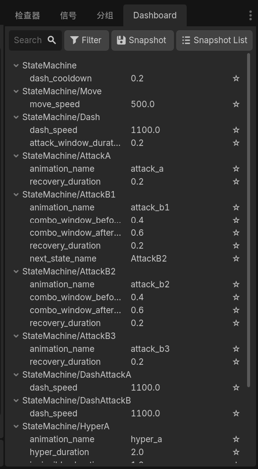
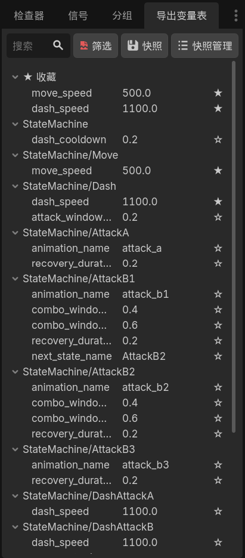

# Scene Exported Properties Dashboard

[👉 阅读中文说明 (Read in Chinese)](#中文说明)

A Godot 4.6 Editor Plugin — Centrally edit `@export` variables for all nodes in the current scene.

Designed for heavy numerical tweaking scenarios such as the game balancing phase. This plugin allows you to browse, search, favorite, and edit exported variables scattered across various nodes, all within a single unified dashboard.



## Features

### Centralized Display & Grouping
- Recursively collects `@export` variables from all nodes in the current scene (including those inside nested sub-scenes).
- Automatically groups variables by node path.
- Sub-scene instances are distinguished by their instance name prefixes (e.g., `Enemy1/Goblin` vs `Enemy2/Goblin`).

### Search & Filter
- Real-time search to filter by node name, variable name, or group name.

### Favorite Variables
- Click the star column (★/☆) to toggle favorites.
- Favorited variables are aggregated and displayed at the top in the "★ Favorites" group.

### Show/Hide Groups
- The filter dialog allows you to check/uncheck specific groups to show or hide them.

### Property Editing
- Directly edit properties within the dashboard.

### Named Snapshots
- Create and name snapshots (e.g., `v1_balance`) to save the current values of all exported variables.
- Snapshot management: view list, one-click restore, and delete.
- Snapshots are saved as JSON files, stored by default in the project's `snapshots/` directory.
- You can customize the save directory (`snapshot_dir`) inside `snapshot_manager.gd`.

## Installation

1. Copy the `addons/scene_exported_properties_dashboard/` folder into your project's `addons/` directory.
2. Enable "Scene Exported Properties Dashboard" in `Project Settings` -> `Plugins`.
3. The dashboard panel will automatically appear in the right dock area of the editor.

## Directory Structure

```text
addons/scene_exported_properties_dashboard/
├── plugin.cfg                  # Plugin configuration
├── plugin.gd                   # EditorPlugin entry point
├── core/
│   ├── property_collector.gd   # Traverses scene tree, collects export vars
│   ├── property_editor.gd      # Reads/writes values and tracks modifications
│   └── snapshot_manager.gd     # Snapshot serialization/deserialization/storage
└── ui/
    ├── dashboard_panel.gd      # Main panel logic
    ├── dashboard_panel.tscn    # Main panel scene
    ├── snapshot_dialog.gd      # Create snapshot dialog logic
    ├── snapshot_dialog.tscn    # Create snapshot dialog scene
    ├── snapshot_list.gd        # Snapshot management list logic
    ├── snapshot_list.tscn      # Snapshot management list scene
    ├── filter_dialog.gd        # Group filter dialog logic
    └── filter_dialog.tscn      # Group filter dialog scene

```

## Snapshot File Format

```json
{
  "scene": "res://scenes/main_scene.tscn",
  "timestamp": "2026-04-30T12:00:00",
  "name": "v1_balance",
  "data": {
    "Player": { "max_hp": 100, "speed": 300.0 },
    "Enemy/Goblin": { "attack_power": 15, "drop_rate": 0.3 },
    "StateMachine/Boss/Weapon": { "damage": 50 }
  }
}
```

## Limitations

- Only collects `@export` variables; non-exported variables are ignored.
- Favorites and show/hide settings are not persistent between editor sessions.
- Currently only supports export variables of GDScript nodes.

---

## 中文说明

# 场景导出变量表

Godot 4.6 编辑器插件 — 集中编辑当前场景所有节点的 `@export` 变量。

面向游戏平衡性调整阶段等大量数值调参场景，让你在一个面板内浏览、搜索、收藏和编辑分散在各个节点上的导出变量。



## 功能

### 集中展示与分组
- 递归收集当前场景所有节点（包括嵌套子场景内部）的 `@export` 变量
- 自动按节点路径分组
- 子场景实例以实例名前缀区分（如 `Enemy1/Goblin` vs `Enemy2/Goblin`）

### 搜索过滤
- 实时搜索，按节点名、变量名、分组名过滤

### 收藏变量
- 点击星标列 ★/☆ 切换收藏
- 收藏变量在顶部"★ 收藏"分组聚合显示

### 显示/隐藏分组
- 筛选对话框可按分组勾选/取消显示

### 属性编辑
- 支持在面板内直接修改属性值

### 命名快照
- 创建、命名快照（如 `v1平衡`），保存所有 export 变量当前值
- 快照管理：列表查看、一键恢复、删除
- 快照保存为 JSON 文件，默认存放在项目 `snapshots/` 目录
- 可在 `snapshot_manager.gd` 中自定义保存目录（`snapshot_dir`）

## 安装

1. 将 `addons/scene_exported_properties_dashboard/` 文件夹复制到项目的 `addons/` 目录
2. 在 `项目设置` → `插件` 中启用 "Scene Exported Properties Dashboard"
3. 面板自动出现在编辑器右侧 Dock 区域

## 目录结构

```text
addons/scene_exported_properties_dashboard/
├── plugin.cfg                  # 插件配置
├── plugin.gd                   # EditorPlugin 入口
├── core/
│   ├── property_collector.gd   # 遍历场景树，收集 export 变量
│   ├── property_editor.gd      # 属性值读写与修改追踪
│   └── snapshot_manager.gd     # 快照序列化/反序列化/存储
├── ui/
    ├── dashboard_panel.gd      # 主面板逻辑
    ├── dashboard_panel.tscn    # 主面板场景
    ├── snapshot_dialog.gd      # 创建快照对话框逻辑
    ├── snapshot_dialog.tscn    # 创建快照对话框场景
    ├── snapshot_list.gd        # 快照管理列表逻辑
    ├── snapshot_list.tscn      # 快照管理列表场景
    ├── filter_dialog.gd        # 分组筛选对话框逻辑
    └── filter_dialog.tscn      # 分组筛选对话框场景

```

## 快照文件格式

```json
{
  "scene": "res://scenes/main_scene.tscn",
  "timestamp": "2026-04-30T12:00:00",
  "name": "v1平衡",
  "data": {
    "Player": { "max_hp": 100, "speed": 300.0 },
    "Enemy/Goblin": { "attack_power": 15, "drop_rate": 0.3 },
    "StateMachine/Boss/Weapon": { "damage": 50 }
  }
}
```

## 限制

- 仅收集 `@export` 变量，不收集非导出变量
- 收藏/显隐设置不持久化
- 仅支持 GDScript 节点的 export 变量

```